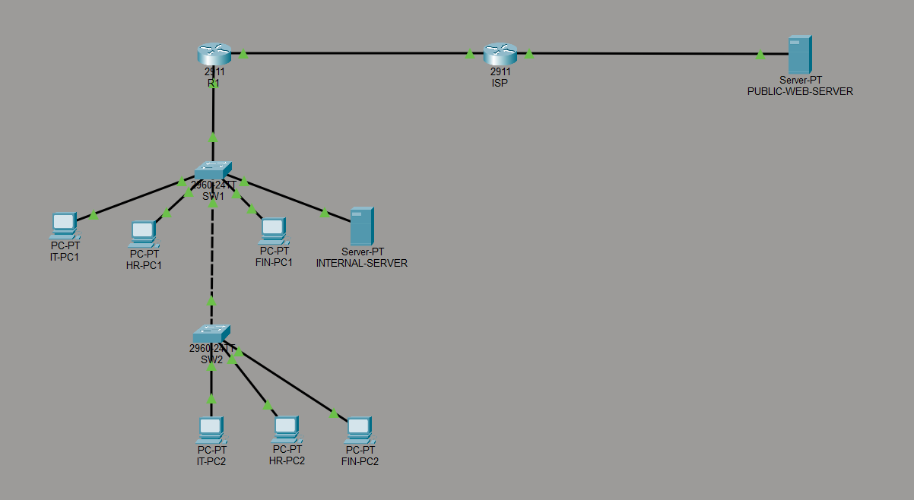
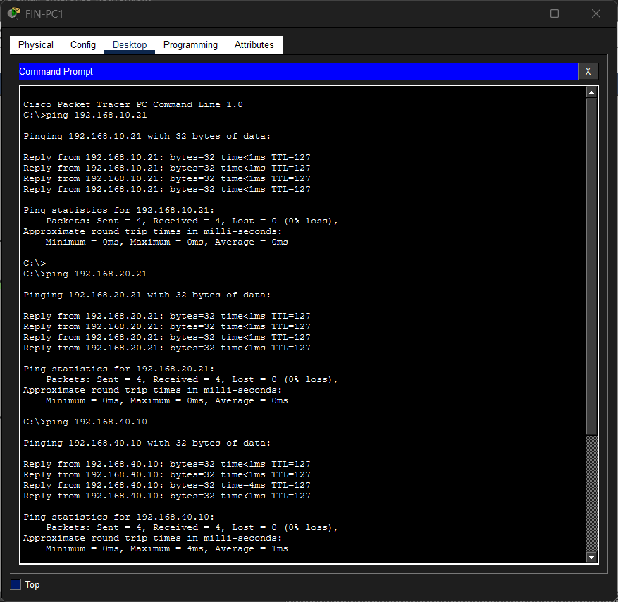
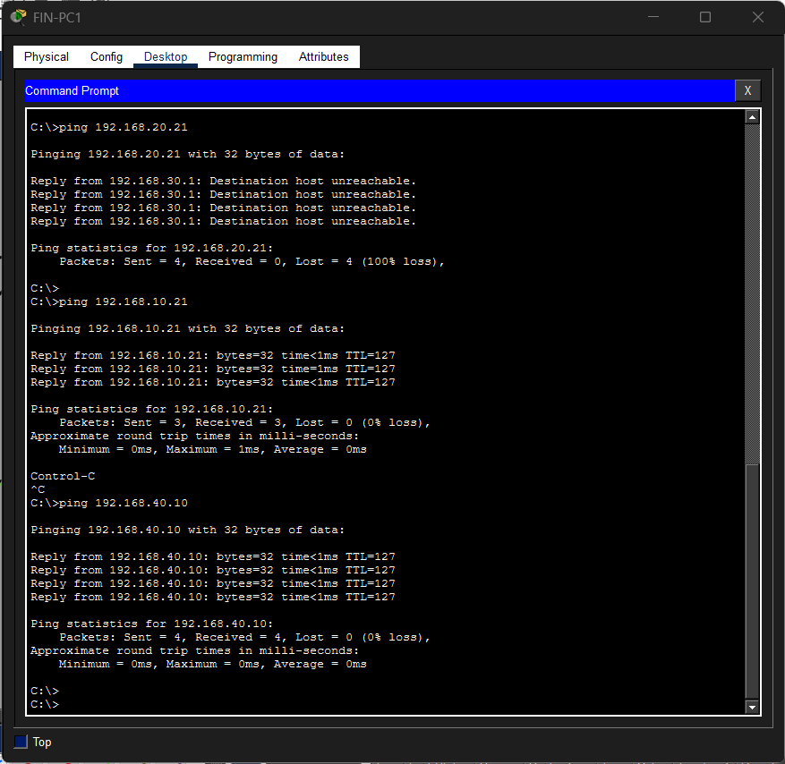
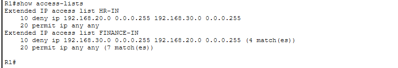
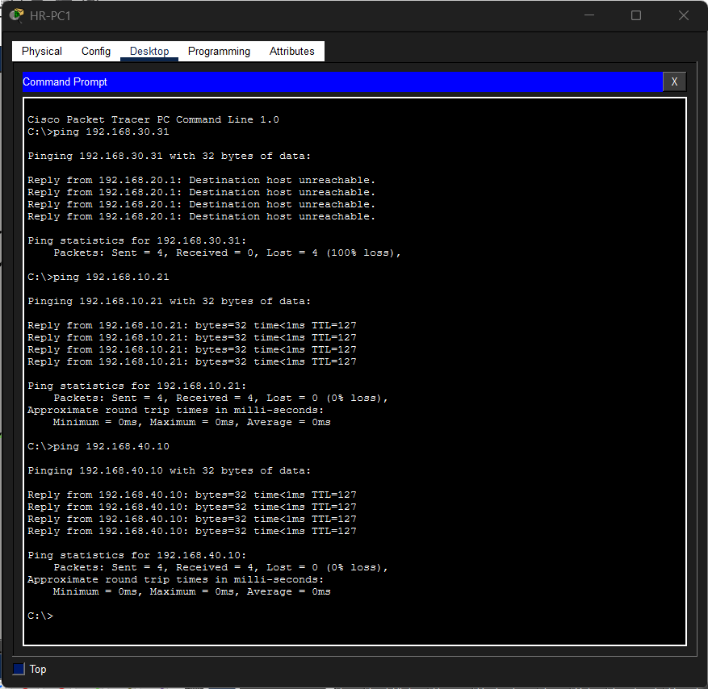
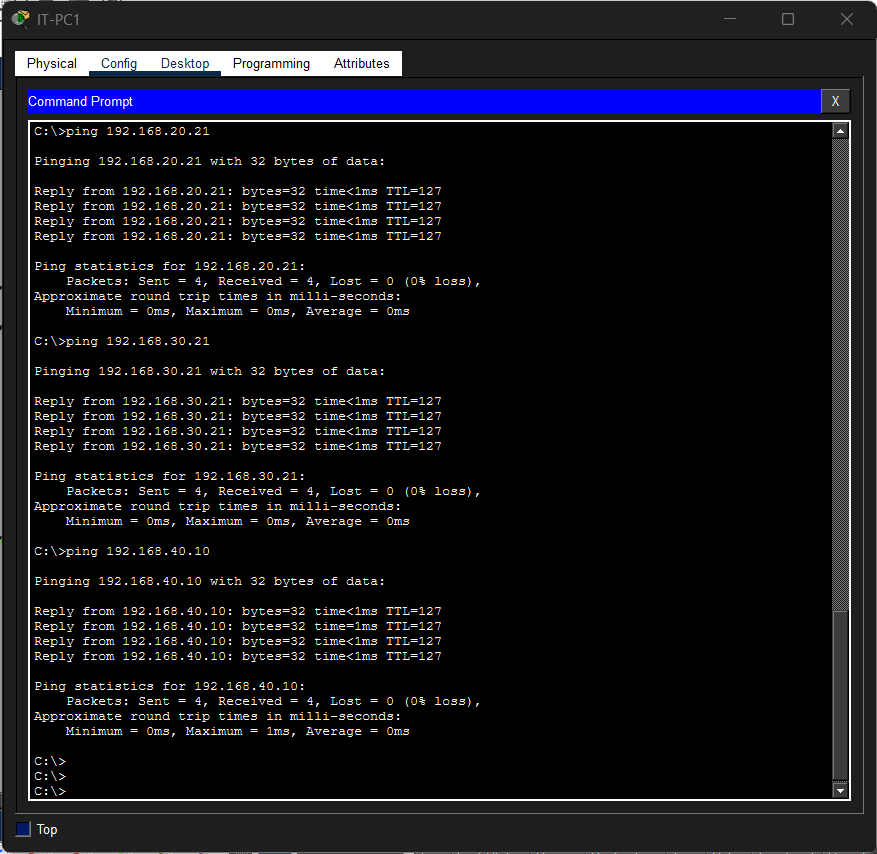
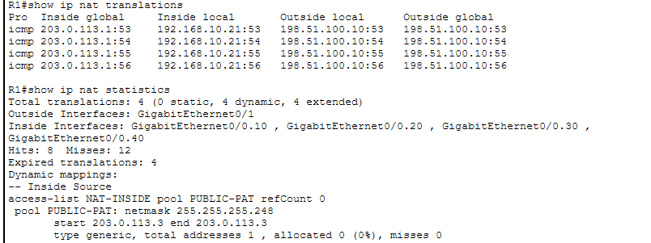
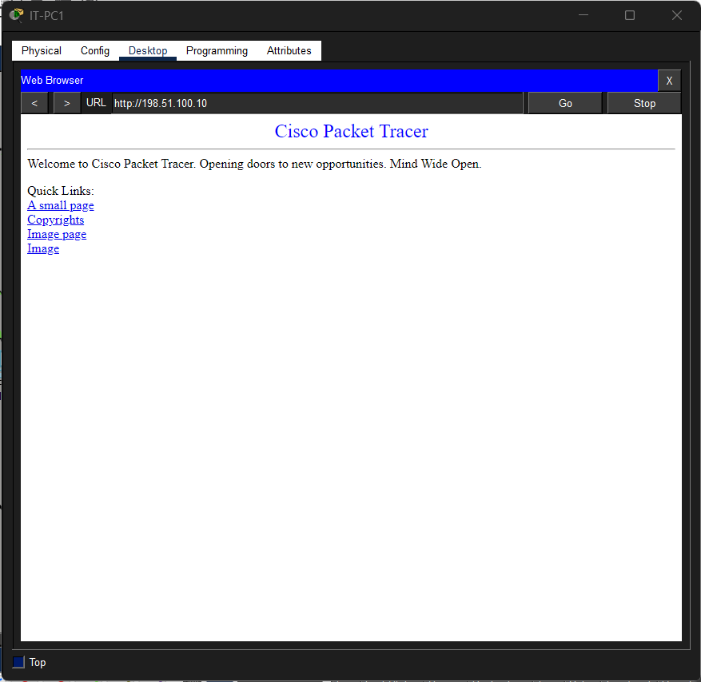

<div align="center">

# Secure Small Enterprise Network Lab


</div>

## Overview

This project documents the design, configuration, and validation of a secure small-enterprise network built in Cisco Packet Tracer.

The lab simulates a small organization with separate IT, Human Resources, Finance, and Server network segments. It includes VLAN segmentation, 802.1Q trunking, router-on-a-stick, DHCP, inter-VLAN routing, extended access control lists, a simulated ISP connection, NAT/PAT, and public web access.

The project demonstrates practical networking, security, troubleshooting, and technical documentation skills relevant to NOC, IT support, network infrastructure, and cybersecurity roles.

---

## Network Topology



The topology includes:

- 2 Cisco 2911 routers
- 2 Cisco 2960 switches
- 6 employee PCs
- 1 internal server
- 1 simulated public web server
- 4 internal VLANs
- 1 simulated WAN/ISP connection

---

## Project Objectives

The main objectives were to:

- Segment departments using VLANs
- Configure access and trunk ports
- Implement router-on-a-stick
- Provide automatic addressing through DHCP
- Enable inter-VLAN communication
- Restrict departmental traffic using extended ACLs
- Simulate internet connectivity through an ISP router
- Configure NAT/PAT for internal clients
- Validate connectivity and security controls
- Document the final configuration and test results

---

## Network Segmentation

| VLAN | Department | Network | Default Gateway |
|---|---|---|---|
| 10 | IT | `192.168.10.0/24` | `192.168.10.1` |
| 20 | HR | `192.168.20.0/24` | `192.168.20.1` |
| 30 | Finance | `192.168.30.0/24` | `192.168.30.1` |
| 40 | Servers | `192.168.40.0/24` | `192.168.40.1` |

The internal server uses a static address:

```text
IP Address:      192.168.40.10
Subnet Mask:     255.255.255.0
Default Gateway: 192.168.40.1
```

Employee PCs receive addresses automatically through DHCP.

---

## WAN and Public Network

| Device | Interface Role | Address |
|---|---|---|
| R1 | ISP-facing interface | `203.0.113.1/29` |
| ISP | R1-facing interface | `203.0.113.2/29` |
| ISP | Public server gateway | `198.51.100.1/24` |
| Public Web Server | External server | `198.51.100.10/24` |

R1 uses a default route toward the ISP:

```cisco
ip route 0.0.0.0 0.0.0.0 203.0.113.2
```

---

## Implemented Features

### VLAN Segmentation

Four VLANs were created:

```text
VLAN 10 - IT
VLAN 20 - HR
VLAN 30 - Finance
VLAN 40 - Servers
```

Access ports were assigned based on department, while trunk links carried multiple VLANs between switches and the router.

### 802.1Q Trunking

Trunking was configured between:

```text
SW1 ↔ SW2
SW1 ↔ R1
```

The trunk links carry VLANs 10, 20, 30, and 40.

### Router-on-a-Stick

R1 uses subinterfaces on `GigabitEthernet0/0`:

```text
GigabitEthernet0/0.10
GigabitEthernet0/0.20
GigabitEthernet0/0.30
GigabitEthernet0/0.40
```

Each subinterface provides the default gateway for its assigned VLAN.

### DHCP

R1 provides DHCP services for the IT, HR, and Finance VLANs.

Addresses `.1` through `.20` were excluded from DHCP so they remain available for gateways, servers, printers, and other infrastructure devices.

Example DHCP pool:

```cisco
ip dhcp pool IT
 network 192.168.10.0 255.255.255.0
 default-router 192.168.10.1
```

### Extended ACLs

The following security policy was implemented:

| Source | Destination | Result |
|---|---|---|
| IT | All internal VLANs | Allowed |
| HR | Finance | Blocked |
| Finance | HR | Blocked |
| HR | IT and Servers | Allowed |
| Finance | IT and Servers | Allowed |

Example HR ACL:

```cisco
ip access-list extended HR-IN
 deny ip 192.168.20.0 0.0.0.255 192.168.30.0 0.0.0.255
 permit ip any any
```

Example Finance ACL:

```cisco
ip access-list extended FINANCE-IN
 deny ip 192.168.30.0 0.0.0.255 192.168.20.0 0.0.0.255
 permit ip any any
```

The ACLs were applied inbound on the corresponding router subinterfaces.

### NAT/PAT

NAT/PAT was configured on R1 so multiple private internal clients could access the simulated public network.

The internal VLAN subinterfaces were configured as NAT inside interfaces, while the ISP-facing interface was configured as the NAT outside interface.

The NAT translation table was used to verify that private internal addresses were translated during outbound communication.

### Public Web Access

The simulated public web server was configured with HTTP enabled at:

```text
http://198.51.100.10
```

Internal clients successfully reached the server through the ISP connection and NAT/PAT.

---

## Validation Results

### Before ACL Implementation

Before applying ACLs, Finance could reach IT, HR, and the internal server.



### Finance ACL Test

Finance could no longer reach HR, while access to IT and the internal server remained available.



### Finance ACL Counters

The deny and permit counters confirmed that traffic was filtered by the router.



### HR ACL Test

HR could no longer reach Finance, while access to IT and the internal server remained available.



### ACL Hit Counters

The ACL counters increased after the blocked HR and Finance tests.


### IT Connectivity

IT retained access to HR, Finance, and the internal server.



### NAT/PAT Connectivity

An internal IT client successfully reached the simulated public server.


### NAT Translation Table

The NAT translation table confirmed that the private internal address was translated during outbound communication.



### Public Web Server Access

The public web page loaded successfully from an internal client.



---

## Verification Commands

The following commands were used during validation:

```cisco
show vlan brief
show interfaces trunk
show interfaces status
show ip interface brief
show ip dhcp binding
show ip dhcp pool
show access-lists
show ip route
show ip nat translations
show ip nat statistics
show running-config
```

---

## Troubleshooting Performed

During the build, several issues were identified and resolved:

- Corrected switch and router interface selection
- Reconnected the R1-to-SW1 link using the intended GigabitEthernet ports
- Verified VLAN assignments with `show vlan brief`
- Verified trunk operation with `show interfaces trunk`
- Confirmed router subinterfaces were in an `up/up` state
- Validated DHCP address assignment on each department VLAN
- Verified ACL behavior using ping tests and hit counters
- Troubleshot NAT/PAT until internal clients could reach the public server
- Confirmed successful translation with `show ip nat translations`

---

## Skills Demonstrated

This project demonstrates practical experience with:

- Cisco Packet Tracer
- IPv4 addressing and subnetting
- VLAN creation and port assignment
- 802.1Q trunking
- Router-on-a-stick
- DHCP configuration
- Static IP addressing
- Inter-VLAN routing
- Extended ACL design and implementation
- Default routing
- NAT/PAT
- Connectivity validation
- Cisco IOS verification commands
- Network troubleshooting
- Technical documentation

---

## Repository Structure

```text
secure-small-enterprise-network/
├── README.md
├── packet-tracer/
│   └── secure-small-enterprise-network.pkt
├── configurations/
│   ├── R1-running-config.txt
│   ├── ISP-running-config.txt
│   ├── SW1-running-config.txt
│   └── SW2-running-config.txt
├── diagrams/
│   └── network-topology.png
└── evidence/
    ├── 01-before-acl-inter-vlan-connectivity.png
    ├── 02-finance-acl-connectivity-test.png
    ├── 03-finance-acl-hit-counters.png
    ├── 04-hr-acl-connectivity-test.png
    ├── 05-acl-hit-counters.png
    ├── 06-it-unrestricted-connectivity.png
    ├── 07-nat-pat-connectivity-test.png
    ├── 08-nat-translation-table.png
    └── 09-public-web-server-access.png
```

---

## How to Open the Lab

1. Install Cisco Packet Tracer.
2. Download the `.pkt` file from the `packet-tracer` folder.
3. Open:

```text
packet-tracer/secure-small-enterprise-network.pkt
```

4. Wait briefly for switch ports and routing interfaces to become active.
5. Use the PCs and device CLIs to review connectivity and configuration.

---

## Possible Future Improvements

Potential extensions include:

- Separate management VLAN
- Switch port security
- DHCP snooping
- Dynamic ARP Inspection
- SSH-only device administration
- Centralized DNS
- Syslog and NTP services
- Redundant switching and routing
- EtherChannel
- Wireless network segmentation
- IPv6 addressing and routing

---

## Conclusion

This project demonstrates the complete design and validation of a segmented small-enterprise network.

The final environment successfully provides:

- Department-based VLAN segmentation
- Inter-VLAN routing
- Automated IP assignment
- Controlled access between departments
- Internal server access
- Simulated public network connectivity
- NAT/PAT translation
- Public web access

The lab strengthened practical skills in Cisco IOS configuration, network security, connectivity testing, and troubleshooting.

---

## Disclaimer

This project was created for educational and portfolio purposes in Cisco Packet Tracer.

The addressing and environment are simulated and do not represent a production network.
